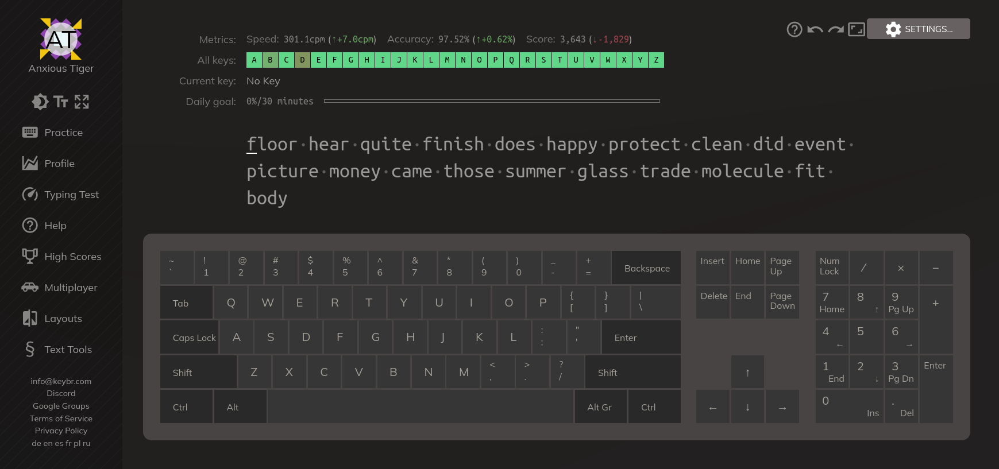
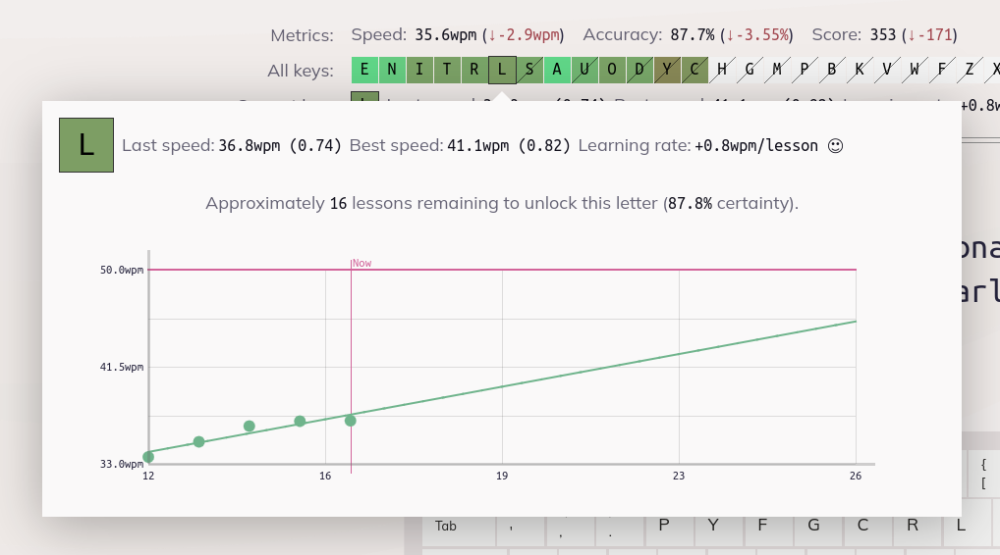

# [keybr.com](https://www.keybr.com/) is not (just) a typing test

    

It's the smartest way to learn touch typing and improve your typing speed.
On the surface, it looks pretty simple: it shows you a piece of text, and you type it out.
But the devil is in the details — keybr.com offers a few unique features:

* keybr.com tracks every single keystroke and computes statistics for each individual key.
* It automatically generates lessons that focus on your weakest keys.
* You can set your own target typing speed, and it tracks your progress toward that goal.
* It starts with a small set of the most frequent letters in your language.
* More letters are added once you reach the target speed with the current ones.
* It can even predict how many more lessons you will need to complete to reach your target speed.
* It provides a beautiful profile page with detailed graphs showing your learning progress.
* It offers plenty of modes and configuration options.

    

## Can I contribute?

Yes!

* **[Give us a ⭐️.](https://github.com/aradzie/keybr.com)** Help this project gain visibility and stand out.
* **[Report a bug.](https://github.com/aradzie/keybr.com/issues)** If something is not working, let us know.
* **[Suggest a feature.](https://github.com/aradzie/keybr.com/issues)** We are open to new ideas.
* **[Translate.](./docs/translations.md)** If you want to see keybr.com in your language.
* **[Getting started.](./docs/getting_started.md)** Launch a local instance of keybr.com, make a pull request.
* **[Add a keyboard.](docs/custom_keyboard.md)** Add a custom keyboard to keybr.com
* **[Add a language.](docs/custom_language.md)** Add a custom language to keybr.com
* **[Join our Discord server](https://discord.gg/gY4RA4enVH).** To discuss things in a less formal way.

## License

Released under the GNU Affero General Public License v3.0.
