# KeyBr.com Architecture Overview

KeyBr.com is a sophisticated web application designed to help users learn and improve their touch typing skills. The application follows a modern architecture with a clear separation of concerns between frontend and backend components, organized as a monorepo with multiple packages.

## System Overview

KeyBr.com utilizes a modern TypeScript/JavaScript stack with React for the frontend and Node.js for the backend. The application is structured as a monorepo using npm workspaces, allowing for easy sharing of code between packages while maintaining clear boundaries between different parts of the system.

### Key Technologies

- **Frontend**: React, TypeScript
- **Backend**: Node.js, Fastr (custom framework)
- **Database**: SQLite (development), PostgreSQL (production)
- **Build Tools**: Webpack, TypeScript
- **Deployment**: Docker, Docker Compose

## Architecture Diagram

```mermaid
graph TD
    %% Core Application Flow
    Client[Browser Client] --> FE[Frontend Application]
    FE --> API[REST API]
    API --> BE[Backend Services]
    BE --> DB[(Database)]
    
    %% Frontend Layer
    subgraph "Frontend Layer"
        FE
        subgraph "Page Components"
            PRACTICE[Practice Page]
            TEST[Typing Test Page]
            PROFILE[Profile Page]
            ACCOUNT[Account Page]
            LAYOUTS[Keyboard Layouts Page]
            MULTIPLAYER[Multiplayer Page]
            HIGHSCORES[Highscores Page]
        end
        
        subgraph "Core UI Components"
            KEYBOARD[Keyboard UI]
            TEXTINPUT[Text Input UI]
            CHART[Charts & Visualizations]
            THEMES[Themes]
            WIDGETS[UI Widgets]
        end
    end
    
    %% Backend Layer
    subgraph "Backend Layer"
        BE
        API
        subgraph "Services"
            AUTH[Authentication Service]
            RESULTS[Results Service]
            SETTINGS[Settings Service]
            LESSONS[Lesson Generator Service]
            MULTI[Multiplayer Service]
            STATS[Statistics Service]
        end
    end
    
    %% Shared Domain Layer
    subgraph "Shared Domain Layer"
        MODEL[Domain Models]
        LANGUAGE[Language Support]
        I18N[Internationalization]
        CONFIG[Configuration]
    end
    
    %% Content Layer
    subgraph "Content Layer"
        WORDS[Word Lists]
        QUOTES[Quote Database]
        BOOKS[Book Excerpts]
    end
    
    %% Data Layer
    subgraph "Data Layer"
        DB
        subgraph "Data Models"
            USER_DATA[User Data]
            TYPING_RESULTS[Typing Results]
            USER_SETTINGS[User Settings]
            HIGHSCORE_DATA[Highscore Data]
        end
    end
    
    %% Infrastructure Layer
    subgraph "Infrastructure Layer"
        DOCKER[Docker Containers]
        LOGGING[Logging System]
        DEPLOYMENT[Deployment Scripts]
    end
    
    %% Relationships (simplified for clarity)
    PRACTICE --> KEYBOARD
    PRACTICE --> TEXTINPUT
    PRACTICE --> LESSONS
    PROFILE --> CHART
    PROFILE --> RESULTS
    
    KEYBOARD --> MODEL
    TEXTINPUT --> MODEL
    
    AUTH --> USER_DATA
    RESULTS --> TYPING_RESULTS
    SETTINGS --> USER_SETTINGS
    
    LESSONS --> WORDS
    LESSONS --> QUOTES
    LESSONS --> BOOKS
    
    LANGUAGE --> I18N
    
    API --> AUTH
    API --> RESULTS
    API --> SETTINGS
    API --> MULTI
    
    BE --> LOGGING
    BE --> CONFIG
```

## Component Breakdown

### Frontend Components

1. **Page Components**
   - Practice Page: Core typing practice experience
   - Typing Test Page: Standardized typing tests
   - Profile Page: User statistics and progress visualization
   - Account Page: User account management
   - Keyboard Layouts Page: Keyboard layout customization
   - Multiplayer Page: Real-time typing competitions
   - Highscores Page: Global leaderboards
   
2. **Core UI Components**
   - Keyboard UI: Virtual keyboard visualization
   - Text Input UI: Text input handling and display
   - Charts & Visualizations: Data visualization for typing statistics
   - Themes: Visual theming system
   - UI Widgets: Reusable UI components

### Backend Services

1. **Core Services**
   - Authentication Service: User authentication and session management
   - Results Service: Processing and storing typing results
   - Settings Service: User preferences and settings
   - Lesson Generator Service: Intelligent lesson generation
   - Multiplayer Service: Real-time multiplayer functionality
   - Statistics Service: Statistical analysis of typing data

2. **API Layer**
   - REST API: HTTP endpoints for frontend-backend communication
   - WebSockets: Real-time communication for multiplayer

### Shared Domain Layer

These packages are shared between frontend and backend:

- Domain Models: Core business logic and data models
- Language Support: Language-specific functionality
- Internationalization: Translation and localization
- Configuration: Application configuration

### Content Layer

- Word Lists: Language-specific word collections
- Quote Database: Typing practice quotes
- Book Excerpts: Extended typing content

### Data Layer

- User Data: User accounts and profiles
- Typing Results: Historical typing performance data
- User Settings: Personalized user preferences
- Highscore Data: Leaderboard information

## Package Structure

KeyBr.com uses a modular architecture with numerous packages that follow a clear naming convention:

1. **Page Packages**: `page-*` - React components for specific application pages
2. **Core UI Packages**: `keybr-*-ui` - Reusable UI components and widgets
3. **Domain Packages**: `keybr-*` - Core domain logic and shared functionality
4. **Content Packages**: `keybr-content-*` - Content data for typing exercises
5. **Server Packages**: `server*` - Backend server and API components
6. **Testing Packages**: `test-env-*` - Testing utilities and environments

## Application Flow

1. User accesses KeyBr.com via a web browser
2. React frontend renders the appropriate page component
3. User interacts with typing interface (keyboard input)
4. Frontend processes keystrokes and displays feedback
5. Results are sent to backend via REST API
6. Backend processes results, updates user statistics
7. Updated statistics are stored in the database
8. New content is generated based on user performance
9. Frontend displays new content and updated statistics

## Deployment Architecture

KeyBr.com can be deployed using Docker and Docker Compose, which provides:

1. Containerized application environment
2. Simplified dependency management
3. Consistent deployment across different environments
4. Volume mounting for persistent data storage
5. Environment-based configuration

The Docker deployment uses environment variables for configuration, particularly `APP_URL` which controls the canonical URL for redirects and authentication flows.

## Data Flow

1. **User Input Flow**
   - Keystrokes → Text Input UI → Result Calculation → API → Results Service → Database
   
2. **Lesson Generation Flow**
   - User Performance Data → Statistics Service → Lesson Generator → Content Selection → New Lesson → Frontend

3. **User Progress Flow**
   - Results Service → Statistics Calculation → Charts & Visualizations → Profile Page

## Conclusion

KeyBr.com represents a well-structured, modern web application with clear separation of concerns. Its modular architecture allows for flexible development and enhancement, while its Docker-based deployment strategy enables consistent operation across different environments.

The application's core strength lies in its sophisticated algorithm for tracking individual key performance and generating personalized lessons, supported by comprehensive data visualization to help users track their progress.